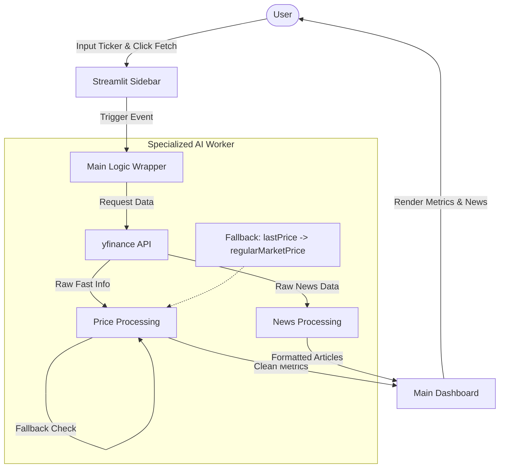
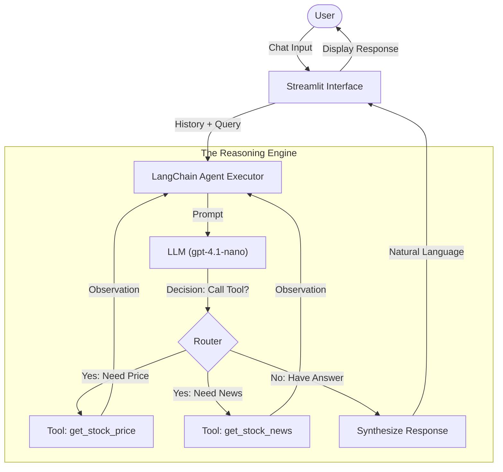

# Example 1


# Specialized AI Worker: Market Analyst

This project implements a **Specialized AI Worker** designed to provide a simple, reliable interface for fetching real-time financial market data. It operates on a specialized logic flow—executing specific tasks without the overhead of complex reasoning engines—to deliver low-latency stock metrics and news.

## 📖 Project Overview

The application is built using **Streamlit** and **yfinance**. It serves as a "Market Analyst" agent that accepts a ticker symbol, interacts with external APIs, and robustly handles data retrieval to present a clean dashboard to the user.

### Key Features
* **Real-Time Metrics:** Fetches current price, day high/low, and calculates daily price deltas.
* **Intelligence Feed:** Retrieves the top 3 most recent news articles for the specified company.
* **Robust Data Recovery:** Implements fallback logic (e.g., swapping `lastPrice` with `regularMarketPrice`) to ensure UI stability even when API data fields are inconsistent.
* **Optimized Performance:** Utilizes the `fast_info` attribute from `yfinance` for low-latency retrieval.
* **User-Centric UI:** Features a "clean state" on startup and error handling that prevents application crashes on invalid inputs.

---

## 🏗️ Architecture

The application follows a **Sequential Workflow**: `Input` $\rightarrow$ `Explicit Function Call` $\rightarrow$ `Structured UI Display`.

### System Flowchart



---

## 📂 Project Structure

* `example_1.py`: The main application entry point containing the Streamlit UI and logic.
* `example_1_Requirements.md`: Defines the functional goals (Speed, Robustness) and UI requirements.
* `example_1_Technical_Documentation.md`: Explains the architectural decisions, including the "Empty State" UI pattern and data fallback strategies.

---

## Getting Started

### Prerequisites

Ensure you have Python installed. You will need the following libraries:

```bash
pip install streamlit yfinance pandas

```

### Running the Application

To start the Specialized AI Worker:

1. Navigate to the directory containing the files.
2. Run the Streamlit command:
```bash
streamlit run example_1.py

```


3. The application will open in your default web browser.

---

## Logic & Implementation Details

### Data Fetching Strategy

The worker prioritizes speed by using `ticker.fast_info`. To handle the volatility of financial APIs, the code uses a multi-layered extraction method:

```python
# Fallback logic ensures the agent doesn't fail if one field is missing
current_price = f_info.get('lastPrice') or f_info.get('regularMarketPrice') or 0.0

```

### UI Interaction

* **Input:** Users enter a ticker (e.g., NVDA, MSFT) in the sidebar.
* **Trigger:** Data fetching only occurs upon clicking the **"Fetch Stock price & News"** button, preventing unnecessary API calls.
* **Output:** Results are split into two columns:
1. **Current Performance:** Metrics and Delta.
2. **Latest Intelligence Feed:** Clickable news cards.


---

## ⚠️ Known Behaviors

* **Empty State:** The application is designed not to auto-load data on startup. You must enter a ticker to see results.
* **API Limits:** Extensive usage may be rate-limited by the Yahoo Finance public API.

```

```

# Example 2


# Agentic Stock Analyst

This project demonstrates an **Agentic AI** workflow. Unlike standard scripts that follow a linear path, this application utilizes an **LLM-driven reasoning loop** to autonomously decide which tools to use based on natural language user inputs.

## 📖 Project Overview

Built with **Streamlit** and **LangChain**, this agent acts as a "Professional Stock Analyst." It is capable of understanding compound requests (e.g., "What is the price of Tesla and any recent news?") and orchestrating multiple tool calls to synthesize a complete answer.

### Key Features
* **Natural Language Interface:** Users interact via a persistent chat interface rather than static forms.
* **Autonomous Tool Selection:** The system utilizes `gpt-4.1-nano` to determine whether to fetch prices, news, or both, based on the user's intent.
* **Conversation Memory:** Maintains session state (`st.session_state`), allowing the agent to remember context from previous turns in the conversation.
* **Multi-Intent Handling:** Successfully parses complex queries involving multiple distinct tasks in a single prompt.

---

## 🏗️ Architecture

The application follows an **Iterative Reasoning Loop**: `Input` $\rightarrow$ `LLM Reasoning` $\rightarrow$ `Dynamic Tool Selection` $\rightarrow$ `Recursive Execution` $\rightarrow$ `Natural Language Summary`.

### Agent Workflow Diagram



---

## 📂 Project Structure

* `example_2.py`: The core application containing the Streamlit UI, Agent definitions, and Tool logic.
* `example_2_Requirements.md`: Outlines the goals for demonstrating advanced AI reasoning and multi-intent handling.
* `example_2_Technical_Documentation.md`: Details the tool-centric design pattern and session management strategies.

---

## 🚀 Getting Started

### Prerequisites

Ensure you have Python installed and an active `.env` file with necessary API keys (OpenAI). You will need the following libraries:

```bash
pip install streamlit yfinance langchain langchain-openai python-dotenv

```

### Running the Application

To launch the Agentic Stock Analyst:

1. Navigate to the directory containing the files.
2. Run the Streamlit command:
```bash
streamlit run example_2.py

```


3. The chat interface will load in your browser.

---

## ⚙️ Logic & Implementation Details

### Tool-Centric Design

The agent's capabilities are encapsulated in standalone functions decorated with `@tool`. This allows the LLM to treat Python functions as extendable skills.

```python
@tool
def get_stock_price(ticker: str) -> str:
    """
    Fetches the real-time current price of a stock ticker.
    Use this when the user asks for the price or current value.
    """
    # ... implementation

```

### Prompt Engineering

The agent is initialized with a specific persona to ensure output consistency:

> "You are a professional stock analyst worker. Be concise and provide links where available.".

### Context Management

The application manages tokens and context by persisting chat history in `st.session_state`. This history is passed back to the `AgentExecutor` on every new run, giving the AI "short-term memory" of the conversation flow.

---

## ⚠️ Known Behaviors

* **Model Dependency:** This agent is configured to use `gpt-4.1-nano`. Ensure your API key has access to this model, or update the `model` parameter in `get_agent_executor`.
* **Latency:** Because the agent may execute multiple steps (Reasoning  Tool 1  Tool 2  Response), it may take longer to respond than a standard script.

```

```
