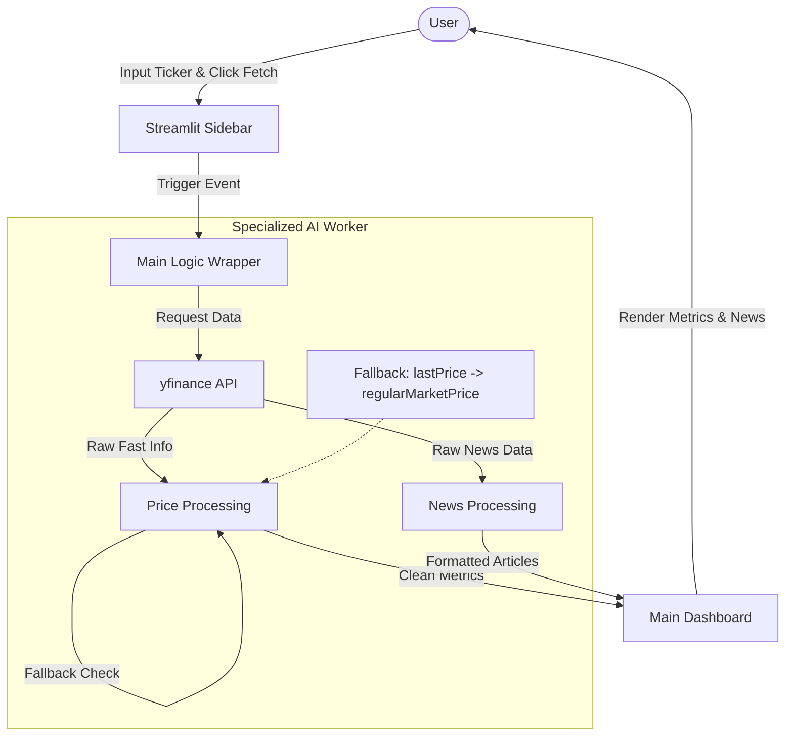

# Example 1

Here is a comprehensive `README.md` file for the attached project files. It incorporates the functional requirements, code implementation details, and technical documentation provided.

### **README.md**

```markdown
# Specialized AI Worker: Market Analyst

This project implements a **Specialized AI Worker** designed to provide a simple, reliable interface for fetching real-time financial market data. It operates on a specialized logic flow—executing specific tasks without the overhead of complex reasoning engines—to deliver low-latency stock metrics and news.

## 📖 Project Overview

The application is built using **Streamlit** and **yfinance**. It serves as a "Market Analyst" agent that accepts a ticker symbol, interacts with external APIs, and robustly handles data retrieval to present a clean dashboard to the user.

### Key Features
* **Real-Time Metrics:** Fetches current price, day high/low, and calculates daily price deltas.
* **Intelligence Feed:** Retrieves the top 3 most recent news articles for the specified company.
* **Robust Data Recovery:** Implements fallback logic (e.g., swapping `lastPrice` with `regularMarketPrice`) to ensure UI stability even when API data fields are inconsistent.
* **Optimized Performance:** Utilizes the `fast_info` attribute from `yfinance` for low-latency retrieval.
* **User-Centric UI:** Features a "clean state" on startup and error handling that prevents application crashes on invalid inputs.

---

## 🏗️ Architecture

The application follows a **Sequential Workflow**: `Input` $\rightarrow$ `Explicit Function Call` $\rightarrow$ `Structured UI Display`.

### System Flowchart



---

## 📂 Project Structure

* `example_1.py`: The main application entry point containing the Streamlit UI and logic.
* `example_1_Requirements.md`: Defines the functional goals (Speed, Robustness) and UI requirements.
* `example_1_Technical_Documentation.md`: Explains the architectural decisions, including the "Empty State" UI pattern and data fallback strategies.

---

## Getting Started

### Prerequisites

Ensure you have Python installed. You will need the following libraries:

```bash
pip install streamlit yfinance pandas

```

### Running the Application

To start the Specialized AI Worker:

1. Navigate to the directory containing the files.
2. Run the Streamlit command:
```bash
streamlit run example_1.py

```


3. The application will open in your default web browser.

---

## Logic & Implementation Details

### Data Fetching Strategy

The worker prioritizes speed by using `ticker.fast_info`. To handle the volatility of financial APIs, the code uses a multi-layered extraction method:

```python
# Fallback logic ensures the agent doesn't fail if one field is missing
current_price = f_info.get('lastPrice') or f_info.get('regularMarketPrice') or 0.0

```

### UI Interaction

* **Input:** Users enter a ticker (e.g., NVDA, MSFT) in the sidebar.
* **Trigger:** Data fetching only occurs upon clicking the **"Fetch Stock price & News"** button, preventing unnecessary API calls.
* **Output:** Results are split into two columns:
1. **Current Performance:** Metrics and Delta.
2. **Latest Intelligence Feed:** Clickable news cards.


---

## ⚠️ Known Behaviors

* **Empty State:** The application is designed not to auto-load data on startup. You must enter a ticker to see results.
* **API Limits:** Extensive usage may be rate-limited by the Yahoo Finance public API.

```

```
